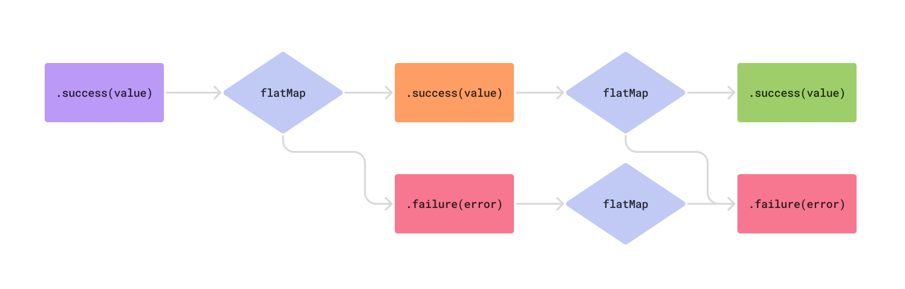

After 5 years of professional development, I recently realized that despite using functional programming concepts in Swift daily, my understanding of them remains surface-level. Object oriented programming, on the other hand, has been ingrained in me since I first discovered it as a kid reading a book about Java gifted to me from my uncle. Over time, I've learned the hard way about OOP's pitfalls: inheritance hierarchies, shared mutable state, and tight coupling, all of which can lead to countless bugs and complex, difficult to understand software.

As a first step towards learning functional programming, I decided to try to understand a term I'd heard, but never attempted to learn: monad. One of the first videos that I found explaining monads was [this video from Computerphile](https://youtu.be/t1e8gqXLbsU?si=ZsvIrnlt32zO628D) which uses Haskell as the example language. The video clearly explained monads, and while the syntax was not too foreign to prevent me from understanding, in order to truly internalize monads I quickly realized I was going to need to work with them in Swift for a bit. Having done that, I figured I'd try to share my learnings as the internet surely needs another explanation of monads that is based on someone else's explanation of monads!

## So, what is a monad?

I've read that once you understand what monads are, you somehow lose the ability to explain them to someone who doesn't. Well, considering it has been less than a week since I crossed that threshold, I'm hoping that I can somehow defy that phenomenon.

A monad is a type that wraps a value. So for instance, instead of declaring a function that returns an `Int`, you could instead return a `Monad<Int>`. Monads allow you to abstract away some additional logic that is ancillary to transformations you apply to wrapped values. Monads let you handle the side effects of transforming values, such as the possibility of not being able to produce a return value. If all this sounds a little like an `Optional` in Swift, your hunch would be correct as optionals are the most prolific monad in Swift! Some other examples of monads in Swift are `Result`, `Array`, and `Set`. However, these types qualify as monads only because of how they're implemented, which brings us to the requirements of monads.

### Monad requirements

**1: pure** - A function that takes a value and wraps it in a monad

```swift
static func pure<Value>(_ value: Value) -> Monad<Value>
```

Also known as "return", this is the simplest way to wrap a value in a monad. It creates a monadic container around a regular value without applying any additional logic or transformations. For `Optional`, the pure function is `.some(_:)`.

**2: map** - This makes the type a *functor*. Called `fmap` in Haskell for "functorial map".

```swift
func map<U>(_ transform: (Value) -> U) -> Monad<U>
```

Don't let the term "functor" intimidate you, just know that it's a prerequisite for monads. If you've used `map` with arrays, you already understand functors intuitively. Optionals also have a `map` function that transforms the wrapped value only when it's not nil, allowing elegant transformations like `optionalNumber.map(NSNumber.init)` without explicit unwrapping.

**3: flatMap** - The core monadic operation. Called `bind` in Haskell.

```swift
func flatMap<U>(_ transform: (Value) -> Monad<U>) -> Monad<U>
```

You probably know `flatMap` best as the method that is like `map` that you use every now and then to avoid nested arrays, at least that was the extent of my understanding for a long time. Again, optionals also have `flatMap` defined. Just like how `flatMap` for collections takes in a closure that transforms a value into a collection of values, `Optional.flatMap` takes in a closure that transforms a value into an optional value while avoiding nesting optionals. So, `flatMap` enables chaining operations that return monadic values.

A monad also needs to follow three laws, which I won't cover in this article because Paul Hudson already has an excellent, succinct [article covering them here](https://www.hackingwithswift.com/example-code/language/what-is-a-monad).

## Working through an example: A recursive expression evaluator

Going back to the Computerphile video that I mentioned, it walks through an example that evaluates a division expression that is defined as what we would call a recursive enum in Swift. I knew that enums could be recursive by using the `indirect` keyword to let Swift know how to allocate the enum, and ironically [the Swift documentation for recursive enums](https://docs.swift.org/swift-book/documentation/the-swift-programming-language/enumerations/#Recursive-Enumerations) demonstrates the concept using an `ArithmeticExpression` enum that is strikingly similar to the enum I've translated from the video:

```swift
enum Expression {
    case value(Int)
    indirect case divide(_ x: Expression, _ y: Expression)
}
```

In order to evaluate expressions defined using this enum, we can write a simple function to recursively evaluate them:

```swift
func evaluate(_ expression: Expression) -> Int {
    switch expression {
    case .value(let value):
        return value
    case .divide(let x, let y):
        return evaluate(x) / evaluate(y)
    }
}
```

However, this function has a problem. If we try to evaluate an expression like `.divide(.value(10), .value(0))` the function will crash when it attempts to divide by zero. We can fix this by writing a function called `safeDiv` that checks if `y` is 0, and if so returns `nil`:

```swift
func safeDiv(_ x: Int, _ y: Int) -> Int? {
    guard y != 0 else { return nil }
    return x / y
}
```

This does mean that our `evaluate` function needs to be updated to handle the fact that dividing returns an optional, and `evaluate` will thus need to return an optional as well. Following the video, the updated function looks like this:

```swift
func evaluate(_ expression: Expression) -> Int? {
    switch expression {
    case .value(let value):
        return value
    case .divide(let x, let y):
        if let x = evaluate(x) {
            if let y = evaluate(y) {
                return safeDiv(x, y)
            } else {
                return nil
            }
        } else {
            return nil
        }
    }
}
```

The presenter in the video then explains that the function is now more complicated than it needs to be, and goes on to explain how we can use a monad to abstract the work of checking the optionals at each step. But the example above is decidedly *not* how we write Swift. We would use `guard let` to unwrap the optionals and simplify the control flow greatly!

However, our goal at the moment isn't writing idiomatic Swift, we are trying to understand monads. So following the video's lead, we can leverage what makes an optional a monad by using `flatMap` (the bind operation that's core to all monads) to chain our evaluations together. This lets us smoothly unwrap the results of `x` and `y`, and then call `safeDiv` with them only if both values actually exist:

```swift
func evaluate(_ expression: Expression) -> Int? {
    switch expression {
    case .value(let value):
        value
    case .divide(let x, let y):
        evaluate(x).flatMap { x in
            evaluate(y).flatMap { y in
                safeDiv(x, y)
            }
        }
    }
}
```

Although we end up needing to nest two calls to `flatMap` in order to unwrap both arguments before passing them on to `safeDiv`, we can start to see how `flatMap` works to handle the work of error checking for us, and short circuting if it encounters an error. While this example is recursive, if we look at a simple chain of optionals linked by calls to `flatMap` to transform them, we can see how this pattern forms a two lane road of logic:


As soon as `none` (nil) is returned from a transformation, the logic short circuits and takes the nil path to the end. Only a seamless chain of `some` values will output a non-nil value. This is sometimes referred to as "Railway Oriented Programming", a term coined by Scott Wlaschin, author of *F# for Fun and Profit*. You can find Scott's [original article on this topic here](https://fsharpforfunandprofit.com/rop/).

## Getting results

The beauty of using `flatMap` like this is that we aren't limited to using it just with optionals. While Swift gives us plenty of tools like guard-let, if-let, optional chaining and nil-coalescing to deal with optionals, those are all specialized language features that _only_ work with optionals. What if instead of just returning an optional Int, we wanted to return a `Result` so that we could let a user know what the error was? We could define an error and update `safeDiv` to return a result with either an integer or an error:

```swift
enum ExpressionEvaluationError: Error {
    case divideByZero
}

func safeDiv(_ x: Int, _ y: Int) -> Result<Int, ExpressionEvaluationError> {
    guard y != 0 else { return .failure(.divideByZero) }
    return .success(x / y)
}
```

That brings us back to our evaluate function. After changing the return type from `Int?` to `Result<Int, ExpressionEvaluationError>`, we can easily update the `value` case by simply wrapping the value in the `.success` case. Because `flatMap` operates in a similar fashion for results as optionals, we don't even need to update the `divide` case at all!

```swift
func evaluate(_ expression: Expression) -> Result<Int, ExpressionEvaluationError> {
    switch expression {
    case .value(let value):
            .success(value)
    case .divide(let x, let y):
        evaluate(x).flatMap { x in
            evaluate(y).flatMap { y in
                safeDiv(x, y)
            }
        }
    }
}
```

Taking a look at the diagram from above modified to show `Result`s, we again see the same pattern, only this time the top lane is the `success` path and the bottom lane is the `failure` path.




## The write stuff

Monads are not limited to enum types that only have two cases. We can explore another type of monad known as the *writer monad*. To do this we will create a new struct-based monad that wraps a value to add logging capability:

```swift
struct Logged<Value> {
    let value: Value
    let logs: [String]

    static func pure(_ value: Value) -> Self {
        Logged(value: value, logs: [])
    }

    func map<U>(_ transform: (Value) -> U) -> Logged<U> {
        Logged<U>(value: transform(value), logs: logs)
    }

    func flatMap<U>(_ transform: (Value) -> Logged<U>) -> Logged<U> {
        let newLogged = transform(value)
        return Logged<U>(value: newLogged.value, logs: logs + newLogged.logs)
    }
}
```

Implementing each of the `pure`, `map`, and `flatMap` functions is fairly trivial. The `pure` function just creates a `Logged` instance with an empty logs array. The `map` function simply applies a transform to the wrapped value without modifying the logs. And finally, `flatMap` applies a transform to the wrapped value, producing another `Logged` instance. The logs from this new instance are then appended to our original logs, preserving the entire history.

We can then use this new `Logged` struct to update `safeDiv` to return logged values:

```swift
func safeDiv(_ x: Int, _ y: Int) -> Logged<Result<Int, ExpressionEvaluationError>> {
    guard y != 0 else {
        return Logged(
            value: .failure(.divideByZero),
            logs: ["Attempted to divide \(x) by 0"]
        )
    }

    let result = x / y
    return Logged(
        value: .success(result),
        logs: ["Divided \(x) by \(y) resulting in \(result)"]
    )
}
```

When updating the evaluate function, we hit a snag. `Logged.flatMap` passes the `value` into the transform closure, and in this case the value is a `Result`. But in order to call `safeDiv`, we need an `Int`, not a result!  To facilitate working with these nested monads, we can extend `Logged` to override `flatMap` when `Value` is a `Result`:

```swift
extension Logged {
    func flatMap<Success, NewSuccess, Failure>(
        _ transform: (Success) -> Logged<Result<NewSuccess, Failure>>
    ) -> Logged<Result<NewSuccess, Failure>> where Value == Result<Success, Failure> {
        flatMap { result in
            switch result {
            case .success(let value):
                transform(value)
            case .failure(let error):
                Logged<Result<NewSuccess, Failure>>.pure(.failure(error))
            }
        }
    }
}
```

In this way we have combined the effects of multiple monads to handle both logging and error handling. In more advanced functional programming, this pattern is formalized as "monad transformers".

Just as before, a minimal update to our `evaluate` function is necessary:

```swift
func evaluate(_ expression: Expression) -> Logged<Result<Int, ExpressionEvaluationError>> {
    switch expression {
    case .value(let value):
        .pure(.success(value))
    case .divide(let x, let y):
        evaluate(x).flatMap { x in
            evaluate(y).flatMap { y in
                safeDiv(x, y)
            }
        }
    }
}
```

Now if we evaluate an expression and print the logs, we can see each step of the process:

```swift
let result = evaluate(
    .divide(
        .value(10),
        .divide(
            .divide(.value(12), .value(2)),
            .divide(.value(9), .value(3))
        )
    )
)
print(result.logs.joined(separator: "\n"))

// Divided 12 by 2 resulting in 6
// Divided 9 by 3 resulting in 3
// Divided 6 by 3 resulting in 2
// Divided 10 by 2 resulting in 5
```

## Conclusion

While Swift doesn't lean into Monads as heavily as pure functional languages, we can still learn a lot from exploring them, and begin to see the potential for them solving certain problems gracefully. While we've covered a few different types of monads here, there are many more worth exploring, including futures/promises, reader monads, I/O monads, and more. And the next time you use `flatMap` on an array or optional, remember: you're using a monad!

